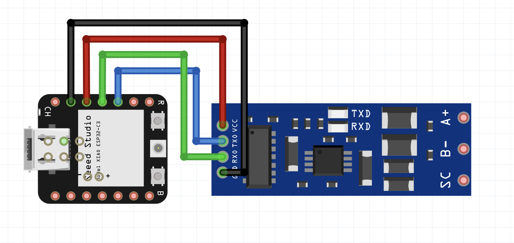

# Electricity counter Modbus RTU reader
This is a Modbus RTU reader node for the [Panopticum](https://github.com/AlexVoidITO/panopticum_show.git) - Power line loss detection server.
Based on the [Seeed Studio XIAO ESP32C3](https://wiki.seeedstudio.com/XIAO_ESP32C3_Getting_Started/) and MAX485 module.
## Hardware diagram
Nothing special over here, just connect the MAX485 module to UART1 pins of XIAO ESP32C3.


## Configure, build, upload
First of all, clone the project properly using ```git clone https://github.com/glutesha/counter-modbus-node --recursive```.    
To configure the project, rename the ```secrets-template.h``` file to ```secrets.h``` and put in your wifi credentials and server hostname. You can also configure your hardware preferences in the ```config.h``` file.    
To build and upload the project, install [PlatformIO](https://platformio.org/) and run ```pio run -t upload``` in the project folder.
